# Tavall Couriers Architecture 

## About

A document that contains decisions and purposes related to the architecture of the Tavall Couriers project. This includes the design of the Gemini Client, the internal API, and the external API. **Not for system administrator architecture decisions.**

# Tech Stack

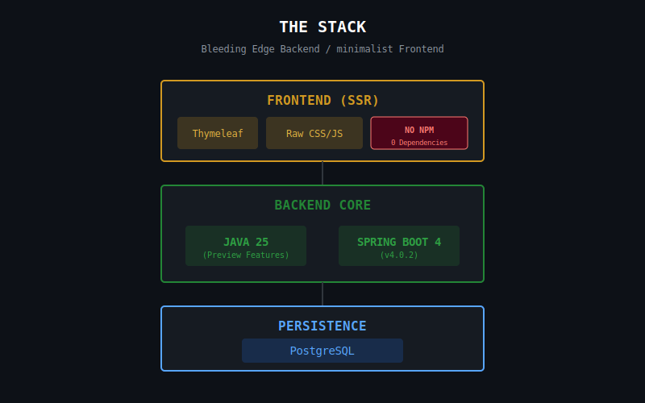

* **Java 25** (Preview Features Enabled)
* **Spring Boot 4.0.2**
* **PostgreSQL**
* **Thymeleaf (HTML)**
* **Raw/Custom CSS and JS**
    * **Why?**: Lower complexity, higher security (zero npm supply chain vulnerabilities), no hydration bloat.

# Libraries & Dependencies

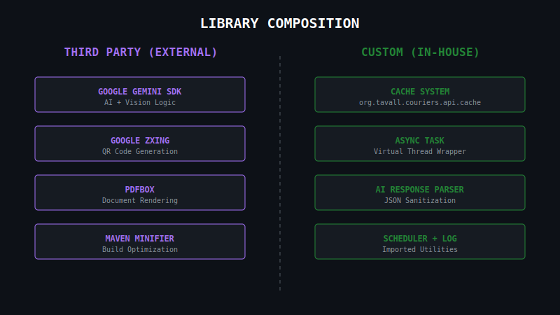

## Third Party Libraries
* **Maven Minifier Plugin**: [https://github.com/logicsquad/minifier-maven-plugin]
* **Google ZXing**: QR Code generation core.
* **Google Gemini SDK**: AI Model interaction.
* **PDFBox**: Label document generation.

## Custom Libraries
* **AsyncTask.java**: Wrapper for Java 25 Virtual Threads.
* **Cache System**: `org.tavall.couriers.api.cache`
* **AIResponseParser.java**: JSON sanitization for LLM outputs.
* **Log.java**: Custom logging class (Imported).
* **QRCodeGenerator.java**: Wrapper around ZXing for specific label formats.
* **Scheduler**: `org.tavall.couriers.api.utils.scheduler` (Imported).

## System Abstractions

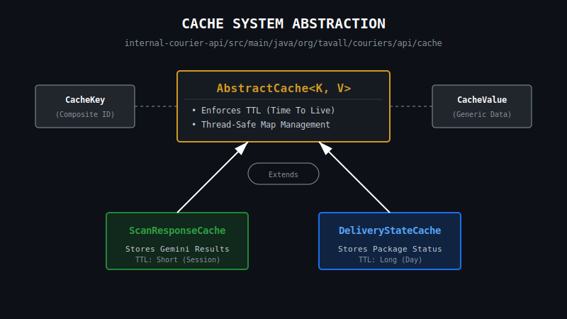

* **AbstractCache(_org.tavall.couriers.api.cache_)** `AbstractCache` -> `CacheKey`/`CacheValue` -> Domained Cache (`ScanReponseCache.java`)

## Gemini Clients

### Separate Gemini Clients
The Gemini Clients are simply a group of classes that delegate tasks to different AI models. Each model has its own specific function and requires different data objects, so these classes act as the dedicated managers for those unique needs.

### What this Solves
1.  **Type Safety:** We don't accidently send a video byte array to a text-only model. The `ImageClient` only accepts `byte[]` and the `TextClient` only accepts `String`.
2.  **Single Responsibility:** If we need to change how we handle image compression, we only edit `Gemini3ImageClient`. The text processing logic remains untouched.
3.  **Config Isolation:** The "Flash" model needs a lower temperature than the "Pro" model. Separating clients allows us to hard-code these optimized settings per client type.

### Other Solutions

#### The Single Service ("God Class")
* **The Idea:** One giant `GeminiService` class that handles everything by passing a "Model Type" flag (e.g., `geminiService.call(Model.FLASH, data)`).
* **Why Rejected:** Flags are type safe be can be mismanaged. It also makes it difficult to add new models without changing the `GeminiService` class. It also allows you to pass, mutate, and return data to the wrong model because the method signature has to be generic enough to accept everything.

#### Direct SDK Access
* **The Idea:** Just letting our Manager classes call Google's `Client` directly.
* **Why Rejected:** It creates tight coupling. If Google changes their underlying SDK method names, we'd have to rewrite code in 50 different places. With our abstraction, we only change it once in the abstract parent class.

## Namespaces
* **Package names**: Verbose > Clean
    * Example `org.tavall.couriers.api.web.endpoints.camera.metadata` > `org.tavall.couriers.api.camera`
* **Class names**: Verbose > Simple
    * **Example**: `CameraFeedEndpoints` > `CameraEndpoints`
    * **Why**: This is a camera **FEED**, not just a camera. Precision prevents confusion.

## Caching

### System Explanation
The Caching module (`org.tavall.couriers.api.cache`) is a custom, in-memory key-value store built on top of Java's `ConcurrentHashMap`. Unlike standard caches that map `1 Key -> 1 Value`, this system utilizes a **Bucket Architecture**, mapping `1 Key -> List<Value>`.

It enforces strict typing via Generics and encapsulates metadata (Source, Domain, Version) directly into the cache keys. Concurrency is managed via `CopyOnWriteArrayList` buckets, allowing for high-performance, lock-free reads while maintaining thread safety during writes.

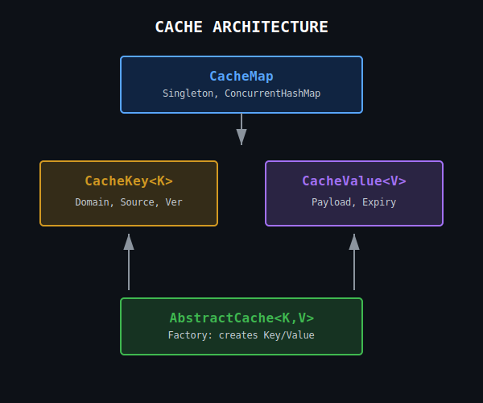

### Key Abstractions
* **Storage (`CacheMap`):** A Singleton extending `ConcurrentHashMap`.
* **Keys (`CacheKey`):** A complex object containing the raw key plus metadata:
    * **Domain:** (e.g., `SCANS`, `USER`) Prevents collisions between different modules using similar IDs.
    * **Source:** (e.g., `AI_SCANNER`) Tracks origin for debugging.
    * **Version:** (e.g., `V1_0`) Allows side-by-side caching of different API versions.
* **Values (`CacheValue`):** A wrapper containing the payload and an expiration timestamp.

### What this Solves
* **One-to-Many Relationships:** We often need to store multiple results for a single identifier (e.g., multiple Scan Errors for a single User ID) without managing complex collection logic in the service layer.
* **Domain Isolation:** Prevents data crossover. A User ID of `101` in the `USER` domain is treated as distinct from a Shipment ID of `101` in the `TRACKING` domain.
* **Type Safety:** Eliminates `Object` casting hell. The `CacheMap` includes helper methods to safely unwrap values into expected classes.

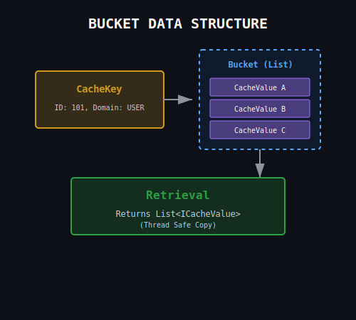

### Why Custom? ("Not using Redis/Caffeine")
* **The Idea:** Use a standard library like Caffeine or a remote store like Redis.
* **Why Rejected:**
    * **Complexity:** Remote caches add network latency and infrastructure overhead not needed for this scale.
    * **Bucket Requirement:** Standard libraries map 1:1. We require a 1:Many bucket system natively. Implementing this in Redis requires complex List serialization that is slower than in-memory object references.
    * **Granular Metadata:** We need keys to carry system metadata (Source/Version) for logging and debugging, which is difficult to enforce in standard string-key caches.
    * **Quick Data Access:** Due to data being in memory, we can access memory nearly instantly

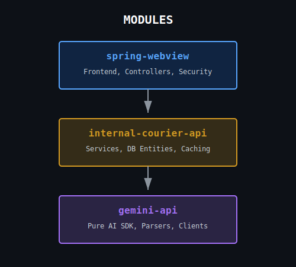

* **gemini-api:** Contains Gemini SDK/API logic, manages AI objects and util classes such as, `Gemini3ImageClient` and `AIResposneParser`.
* **internal-courier-api:** Contains internal API logic, manages internal logic, that is later used in module "spring-webview".
* **spring-webview:** Contains Spring Boot application logic, manages front end visuals.

## Concurrency

### Custom Concurrency Lib using Java Virtual Threads
* A custom concurrency library built around Java Virtual Threads is used to manage concurrent tasks. We confirm Virtual Threads are truly concurrent before building the library. Test class: "StructuredConcurrentTest.java"

<pre><code>[Main] Opening StructuredTaskScope...
[Main] Forking tasks...
  -> [Thread: ] START test (Slow)
  -> [Thread: ] START test2 (Fast)
  -> [Thread: ] FINISH test2 (Fast)
  -> [Thread: ] FINISH test (Slow)
[Main] Tasks finished. Combining results.
Final Result: test2test
Total Duration: 68ms</code></pre>
_"test" method is slept 50ms to test concurrency. Both methods simply return strings._

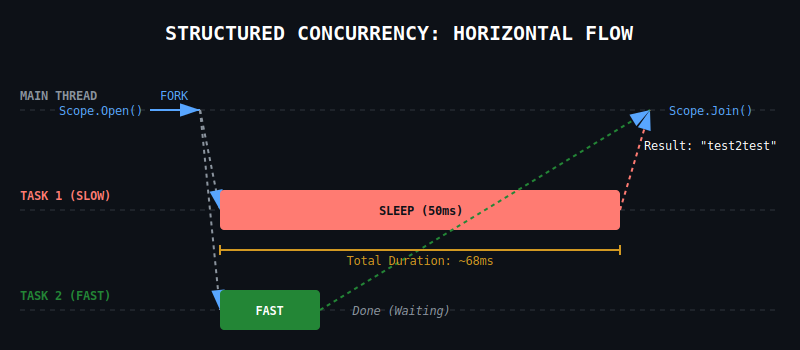

#### Java Virtual Threads Limits
* Not everything is automatically atomic. We still need to declare Atomic objects, like `AtomicInteger` for example.
* If two Substacks (tasks) touch mutable data that aren't Atomic, we need proper concurrency controls for those objects.

### Scanning Concurrency
We use Java Virtual Threads for scanner concurrency, instead of ThreadPools. Virtual Threads are more efficient and scalable than manually managing threads.

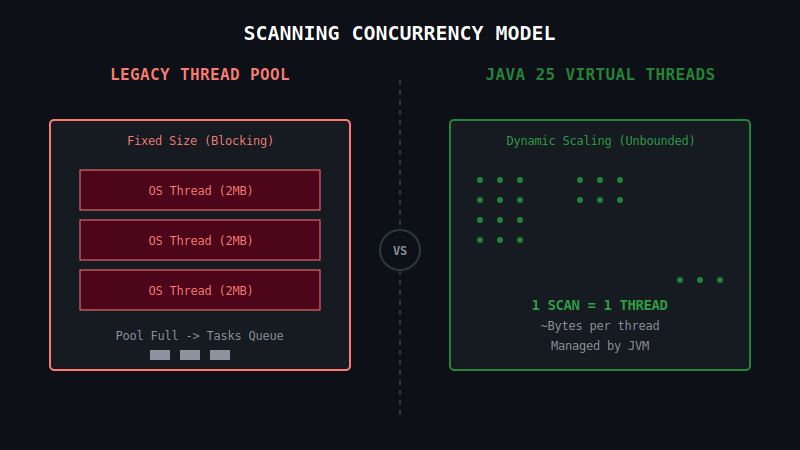

* **Thread Pool Limits:** Memory cost ~2MB per thread, pre-set pool size, every thread made is a real OS thread (blocking behavior), which isn't needed for scanning.
* **Virtual Thread Advantages:** One scan response = One Thread. Threads are not "pooled," allowing true concurrency. Less worry about thread safety, allocation amount, and can be scaled up or down dynamically without extra logic.

# Front End

## CSS, HTML, and JS
* **Java Orchestration:** Java handles as much front end object creation and orchestration as possible, acting as the Single Source of Truth for UI state.
* **Thymeleaf Rendering:** We use Thymeleaf to hydrate HTML templates with this Java data.
* **Coupled Assets:** CSS and JS are coupled with Java objects (via config classes) to ensure style and behavior are consistent with backend logic.
* **Domained CSS Helpers:** Each CSS domain exposes Java CSS utility classes + Spring beans (e.g., `DashboardTemplateCss`), so templates compose class strings from a single source of truth.
* **Minimal JS:** No frontend framework; state changes are wired through `data-*` attributes and small event handlers.

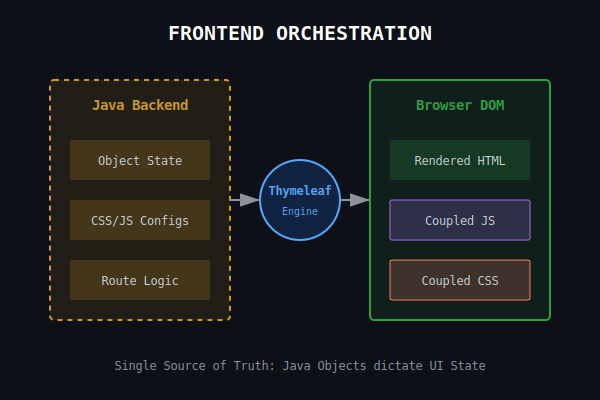
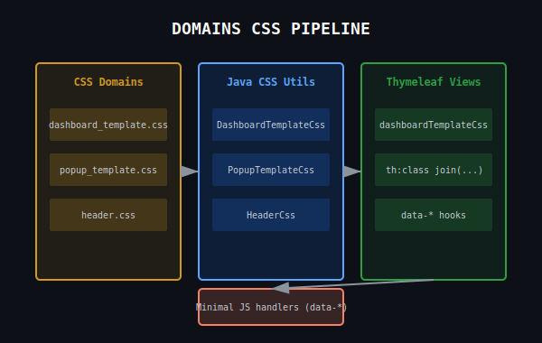

## Thymeleaf HTML Flow
* **Controller -> Model:** Controllers populate `Model` attributes and return a view name.
* **Template Hydration:** Thymeleaf resolves fragments, then applies `th:*` bindings (class/text/ifs) using model data.
* **Static Output:** Rendered HTML is static in the browser, with CSS + JS hooks layered on top.

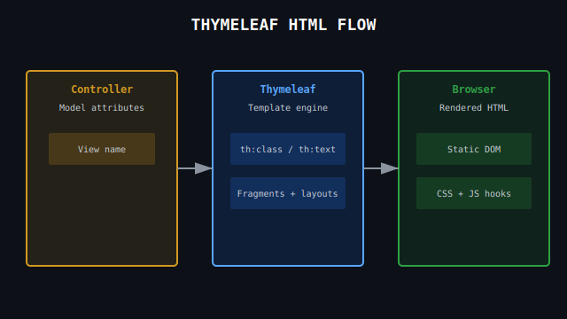

## Popups / Modals
* **Shared Modal Shell:** Popups use the `scan-modal` scaffold (backdrop + panel + frame) defined in `popup_template.css` and `camera-modal.html`.
* **Embedded Details:** Label/route detail popups render via iframe and use `postMessage` for close + resize coordination.
* **Camera Popups:** Camera views reuse the same modal shell with camera-specific frame styling.

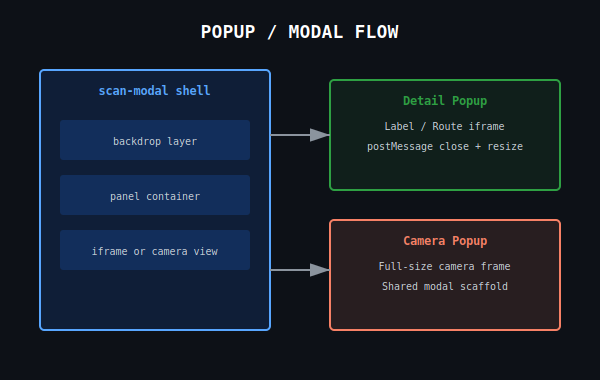

## Async UX
* **Placeholder States:** UI renders "Waiting for data..." where server-side or async data has not arrived yet.
* **Generating Message:** Rate-limited "Generating... give us a few seconds.." messaging is reused across async flows.

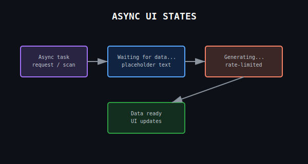

## Routes
* **Centralization:** Routes are centralized in `Routes.java` which serves as the **Single Source of Truth** for the entire application (Controllers, Tests, and Frontend Templates).
* **Dependency Flow:** Controllers do not define paths; they *consume* paths defined in `Routes.java`.

## Route Endpoints
* **Domain Enums:** Route endpoints are defined in specific enum classes (e.g., `AppEndpoint`, `CameraEndpoint`) based on their domain.
* **Unified Access:** `Routes.java` aggregates these enums, allowing developers to access any route from a single static entry point.
    * **Package:** `org.tavall.couriers.api.web.endpoints`
    * **Example:** `RouteEndpoint.DELIVERY_STATE` -> `/delivery/state`

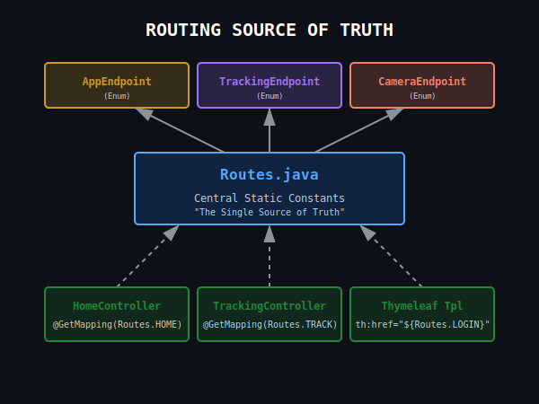