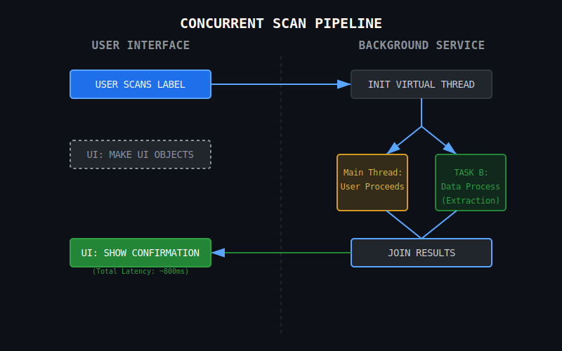
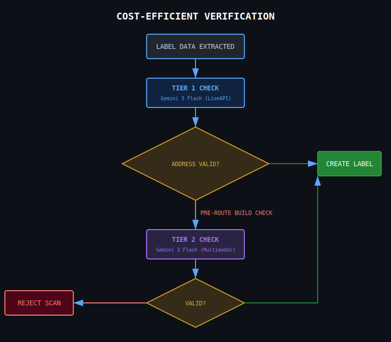

# About
This document contains the challenges for the Tavall Couriers project. Each challenge is described in detail, along with the expected implementation and any additional context or requirements.

# CHALLENGE 1: Gemini 3 Scan QR and OCR scan Concurrency
## Problem
Gemini 3 scans a QR code and a page's metadata, but this process takes 8.1 seconds and will stall our scanner. This process must be concurrent to improve the visual performance and flow of the scanning flow.

Gemini 3 Scan Response

<pre><code>--- STARTING GEMINI 3 FLASH VISION TEST ---
Loading Image: F:\workspace\TavallCouriers\spring-webview\QRWithData.png
--- GEMINI RESPONSE (8157ms) ---
ScanResponse[uuid=550e8400-e29b-41d4-a716-446655440000, cameraState=FOUND, trackingNumber=TRK-GOOGLE-9988, name=Google Gemini, address=1600 Amphitheatre Pkwy, Mountain View, CA 94043, phoneNumber=(555) 019-2834, deadline=null, notes=Do not bend. Contains data.]</code></pre>

## Solution
1. Stream Gemini 3's process using Google's Gemini 3 SDK built-in stream response.
2. Log in the background; Let the user see a completed scan, but run the scan in the background.
3. Process scan results in the background while the user is scanning.

## Edge Cases
If a user is done scanning before streaming is complete?
* This is where we finally show the user a waiting screen OR
* Possible upgrade: Go to the confirmation page for scanning, fill any data we already have, then live-fill the rest of the data as scan responses come in. This way the user can start viewing confirmation/routes without having to wait.

# CHALLENGE 2: I/O Performance
## Problem
While Gemini 3 is sending a response, we have a "File" object open in linux. If multiple active scans are running, we may run into bottlenecks.

## Solution
1. Change Linux file system limits to allow more open files.
    * **Important**: Running the app as a Linux service on in something like Docker will nullify the Linux File Limit changes.
2. How to change Linux file system limits?
    * To set the limit to 1048576, run increase_file_limit.sh
    * To set the limit higher, run(kernel changes):
   <pre><code>sysctl -w fs.nr_open=20000000
   sysctl -w fs.file-max=20000000
   ulimit -n 20000000</code></pre>
    * View PERFORMANCE_LIMTS.MD to view application performance limits.

# CHALLENGE 3: Wasted Compute on Bad Frames (The "Bouncer")
## Problem
Blindly sending every camera frame to the Cloud API is a rookie move. It burns money and lags the UI when the user is simply pointing the camera at the floor or their shoes.

## Solution
We implemented a custom "Bouncer" algorithm that runs locally on the CPU *before* we even think about calling Gemini.
* **Technique:** Analyze the raw byte array for `luminance` variance and edge density.
* **Result:** If the image is too dark, too blurry, or lacks contrast (like a blank wall), we kill the request instantly. No API call, no cost, zero latency. Only the "good stuff" gets through.

# CHALLENGE 4: Thread Scalability (Project Loom)
## Problem
Standard Java platform threads are heavy (~2MB RAM each). If a logistics hub tries to scan 5,000 packages at once using standard thread pools, the server melts and we hit `OutOfMemoryError`.

## Solution
We ditched traditional pools for **Java 25 Virtual Threads**.
* **The Flex:** These threads are managed by the JVM, not the OS. They are practically free.
* **Result:** We can spawn a fresh virtual thread for *every single scan request*. No blocking, no "thread pool exhaustion," and we aren't eating RAM like it's a Chrome tab. Massive vertical scalability for free.

# CHALLENGE 5: Agentic Round-Trip Latency
## Problem
The standard "AI Agent Loop" (Ask -> Model requests Tool -> Server Exec -> Model responds) takes 3-4 seconds. A courier scanning boxes needs an answer *now*.

## Solution
We force the decision in one shot using a "Pseudo-Tool" hack.
* **The Hack:** We inject a `functionCall` definition directly into the JSON Schema of the response. We don't wait for the model to "ask" to run a tool; we force it to structure the data *as if* it called the tool in the very first reply.
* **Result:** Latency cut in half. We get structured, validated JSON data in a single round-trip.

# CHALLENGE 6: Verification Cost Efficiency
## Problem
Burning "Pro" model tokens to verify a simple text address is overkill and drains the budget.

## Solution
A tiered escalation system.
* **Tier 1 (The Intern):** We use `Gemini 2 Flash Lite` for rapid, cheap text verification.
* **Tier 2 (The Boss):** If the Lite model gets confused or the image is tricky, we escalate to `Gemini 3 Flash/Pro` to handle the heavy lifting.
* **Result:** We save budget on the easy stuff so we can afford the smarts for the hard stuff.

# CHALLENGE 7: Frontend Complexity & Security
## Problem
Modern frontend frameworks (React/Angular) introduce massive dependency chains (`node_modules`), brittle build pipelines, and increased attack surface.

## Solution
"No-Build" Architecture.
* **Tech:** Server-side rendered Thymeleaf with raw, hand-tuned CSS and Vanilla JS.
* **Result:** * **Speed:** Pages load instantly (no hydration wait times).
    * **Security:** Zero npm supply chain vulnerabilities.
    * **Sanity:** No webpack config hell. It just works.