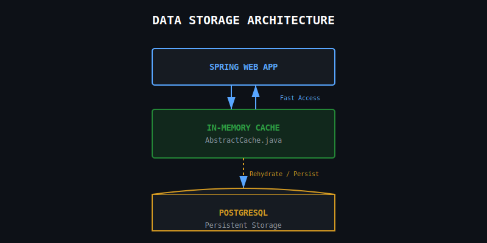
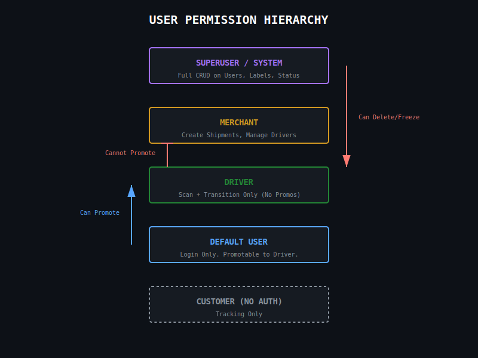
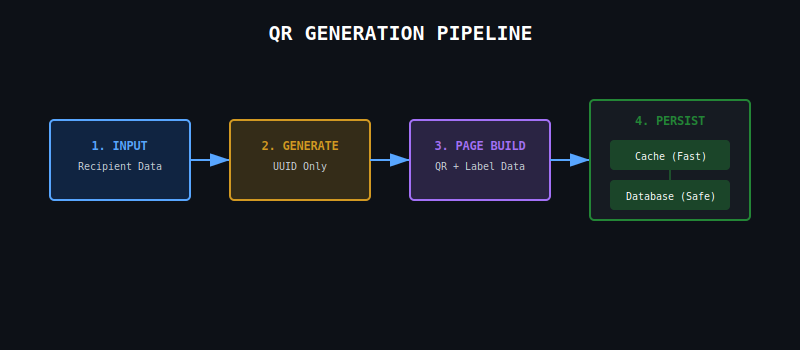
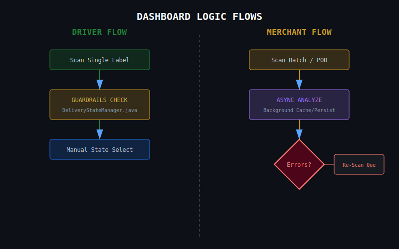
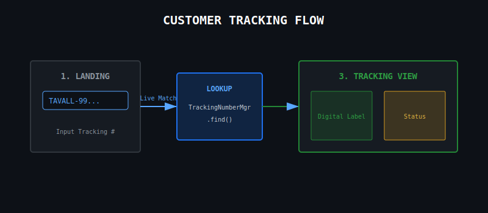
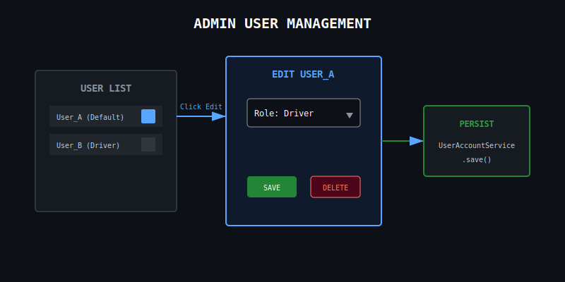

# Application Flows 

## Flow Rules:

* Spring Boot is used for the Web Server for this project

1. All data creation, data persistence, and data retrieval are handled in java, meaning these flows should remain as much as a visual layer as possible.
    * Any data objects not created were either missed or not yet created.
2. Web flows should keep mobile optimization (view and performance) in mind.

# Data Storage

## Memory Storage

* A 'AbstractCache.java' system was built to deal with in memory storage, mostly concurrently.
    * View package: **com.tavall.couriers.api.cache**

## Persistent Storage

* **Postgres** is used to store our data long-term. It is also used to rehydrate caches from downed systems.
    * View package: **com.tavall.couriers.api.database**

# User Permissions Flow

* The main promotion and demotion are handled by 'UserAccountService.java'
    * Permissions system classes are located in package: **org.tavall.couriers.api.web.user.permission**

## Customer (Non-Authenticated User)

* For dashboards, Non-authed users may only view a login screen
* This user only has access to tracking, given they have a tracking number.

## User (Default Account)

* This user can login, but can't interact with the application.

* Can BE Promoted?: YES
    * Can BE promoted to: Driver
* Can BE Demoted?: YES
    * This is the bottom of the hierarchy. Deletion is the only option left.
* Can BE Deleted?: YES
    * Can BE deleted by: Merchant or Superuser

## Driver

* Can BE Promoted?: NO
    * This is the last step in the user hierarchy.
* Can BE Demoted?: YES
    * Can BE demoted by: Merchant or Superuser
* Can BE Deleted?: YES
    * Can BE deleted by: Merchant or Superuser

## Support
* TODO: Add support permission flow

## Merchant

* Merchant accounts must be created by a Mercahnt, Superuser, or System.

* Can BE Promoted?: NO
    * Merchant accounts must be created
* Can BE Demoted?: NO
    * Merchant accounts can only be frozen, disabled, or deleted.
* Can BE Deleted?: YES
    * Merchant accounts can only delete/diable themselves.
    * A Superuser can freeze, disable, or delete the account as well.

## SuperUser (Admin Account)

* Can BE Promoted?: NO
    * This is the last step in the user hierarchy.
* Can BE Deleted?: NO
    * Can BE deleted by: Merchant or Superuser

* Superuser is the overseeing admin of the entire instance. This user has all driver and merchant permissions, with the following:

1. Superuser can view, edit, or destroy any/all shipment labels.
2. Superuser can also view, edit, or destroy any/all users and/or their roles.
3. Superuser can also view, edit, or destroy any/all active delivery statuses.

## System (Admin Account)
* A user that is used for schedule tasks, system monitoring, and tagging.
* Jobs:
    * Schedule Tasks: If we schedule a task with a user that loses permissions later, we lose the job. Use 'System user' for these types of tasks.
    * System Monitoring: Monitor the system for any issues or errors.
    * Tagging: Tag methods that users usually fire with 'System.' Example log: "System created a new user." This log can be created by a user or system.

# QR Generation Flow

## Caching and Persistence
1. A customer, dispatcher, or on-floor employee creates a shipment
    * Shipment page: Input recipient data (name, address, etc.) -> Continue to QR Generation
2. System generates; QR with just a UUID (unfilled shipping label data)
3. Page creation; a page with the QR code and Shipping label data is created and saved
4. Save into QR Data and Shipping Label Data into cache -> database for reuse and identification

# Account Registration Flows

## User Registration

## Merchant Registration

# Dashboard Flows

* Dashboards (and other pages) use thyemleaf/java as much as possible, so we can follow DRY and not have to change code in multiple locations.
* Dashboards should be unique to the roles from 'Role.java'

## Dashboard Login Flow

* All dashboard login flows can live under one endpoint, as defined package: **org.tavall.couriers.api.web.endpoints**
    * e.g Each account will use the same endpoint as defined by
1. Login Screen;
    * Logo above the username/password box
    * Should have a username/password section, authentication is powered by Spring
    * In a neat section, have the user/password for the users below.
    * Default for Driver: username: driver password: driver
    * Default for Merchant: username: merchant password: merchant
    * Default for Superuser(admin): username: superuser password: superuser
    * These credentials should be in a drop-down menu under the login box to demo the flows fully.

## Driver Dashboard

* Drivers can only change the transition state on the tracking number/QR code with guardrails defined in 'DeliveryStateManager.java'
    * The demo flow will need a way to create a label.

* Pre-scan page:
1. If no labels are prepared to scan, have the user create a shipping label before we can scan QR.
    * Give the user the option to make new labels anyway even if there are labels available.
        * Give the option to move onto the scan page if they don't want to make labels.

2. While caching and persisting, make the user can proceed to the next scan lag-free
3. With the label we just created, have the user scan the shipping label digitally
    * The scan page;
    * Camera: Option to use screen sharing to scan documents
    * Camera: Within the camera feed view, add small text that says what the camera is from. e.g "Tavall Couriers and Logisitcs Camera Tool"

4. Once scanned, let the user select the transition state. Some states transitions are off-limits at this level, as defined in 'DeliveryStateManager.java' → Continue to Scan Transition Completion Confirmation Flow

5. The scan confirmation flow;
    * This should be a popup, so we stay on our scan page
    * The user should be able to select the transition state from a dropdown menu
    * Transition Selection Menu: Transitions that can be complete should be shown, and one that can't should be greyed out. Guardrails are laid by class 'DeliveryStateManager.java'

## Merchant Dashboard

Merchants can have multiple user levels; for the demo, we're sticking to an admin flow showcase, for now.

1. Have the user create shipments labels
    * Shipment page: Input recipient data (name, address, etc.) -> Continue to QR Generation
2. System generates; QR with just a UUID (unfilled shipping label data) and transition between ANY state.
3. Scan page;
    * Helps the Print on Demand (POD) process; A user can receive a print with a QR code and shipping label data, then scan it.
      A tracking number, qr code, and shipping label data are created in the system for further usage.
    * Camera: Option to use screen sharing to scan documents, use the same as driver scanner camera class
4. 'analyzeFrame' method runs async, we should be able to continue to the next scan while the system caches and persists in the background.
    * If there are any cache or persistent errors, show the user once they're done with scanning → Re-scan Flow
    * Re-scan flow: Show the user a list of documents with the errors
    * When the user selects one, a scanner comes up for a re-scan. The scanner persists until all the error documents are scanned.
    * TODO: If caching AND persistence are broken, we can move to a offline file format and rehydrate our caches and databases at a later point.
5. On every scan we should have a success message, this doesn't check anything, just acknowledges the scan.
6. To complete scanning, there should be a button to complete the scanning process.
7. Back to the dashboard main page for shipment creation (end/restart demo flow)

# Customer Tracking Page

* Customers can view their shipment based off their tracking number.
* Tracking Page;
    * Start with a page that the user can use to enter their tracking number
    * Live match when the user completes typing/pasting and forwards to the page with the tracking information.
        * All tracking numbers start with 'TAVALL'
        * Option to track multiple shipments, make this a list view. Disable live completion forwarding for this.
    * Tracking information page;
        * We save a digital copy of the shipping label, we can display it here.
        * Display the shipping label data for the shipment
        * Display the delivery status of the shipment
        * Display the delivery date/time of the shipment

# User Promotion and Creation

* Superuser, merchant, or system can create, delete, promote, or demote a user.

## User Management

1. This option lives in the "Admin" options in the dashboard.
2. "Manager Users" button to go to the user management page
3. User Management Page;
    * List of all users
    * Edit user button on the side of the user →
    * Popup to edit user details such as role, and user details.

## User Management Navigation

* Defines how we make it to the user management page from the main dashboard, given we have the right permissions.

1. Have an extra option called "Admin" in the main dashboard for the users that can edit permissions.