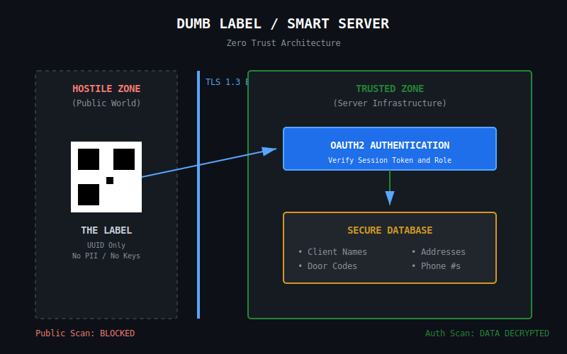
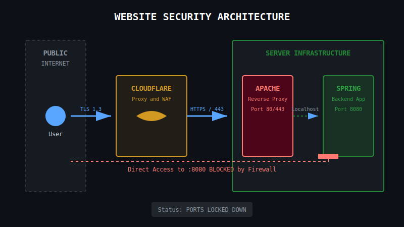

# SECURITY POLICY & ARCHITECTURE

## 1. Overview

This document outlines the security posture for the Gemini Courier Workflow Platform. Our philosophy is **"Trust Nothing, Verify Everything."** We assume the client is compromised and the network is hostile. The QR code is public information we must protect.

## 2. QR Creation Security (The "Dumb Label")

We deliberately avoid embedding sensitive data such as address, keys, phone numbers, endpoints, etc. into the physical QR codes.

* **Payload:** The QR code contains *only* a UUID.
* **Zero Trust:** A scanned UUID grants **zero privileges** on its own. It is merely a pointer to a database record.
* **Immutability:** Physical labels are static; therefore, security measures must be dynamic (server-side).
  

## 3. QR Scanning Security (The "Smart Scanner")

Access to the scanning endpoint is strictly gated behind role-based authentication.

* **Auth Identity:** Spring Boot uses OAuth2 for authentication.
* **RBAC (Role-Based Access Control):**
    * `ADMIN`: Overall system control.
    * `VENDOR`: Creates intake forms for drivers to scan/print.
    * `DRIVER`: Can only scan to change status (Pickup -> In Transit -> Delivered).
    * `DEFAULT`: No access. Scanning the QR code without a session fails gracefully.

## 4. Website Security  

**SSL with TLS 1.3** with a cloudflare proxy is used for secure communication.

* The main Spring Boot application is proxied through apache.
  * This allows us to firewall off spring ports to keep Spring backend local.

